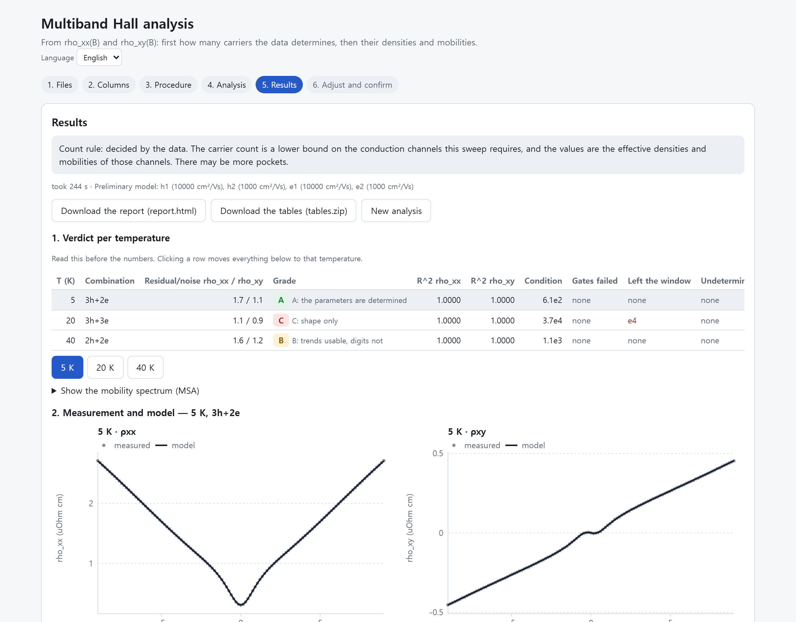

# mbfit 안내 — 무엇을 하고, 무엇을 말할 수 있고, 어떻게 쓰는가

> 영어 안내는 저장소 맨 위의 `README.md` 입니다. 이 문서의 앞부분은 그 번역이고,
> "파일 대응" 부터는 이 폴더의 문서 안내입니다. **정본은 영문입니다.**

`rho_xx(B)` 와 `rho_xy(B)` 로부터 데이터가 부호마다 몇 개의 전도 채널을 요구하는지,
각각의 유효 밀도와 이동도가 얼마인지, 그리고 **그 숫자들보다 먼저** 곡선이 얼마나
잘 맞는지와 그 숫자가 결정되기는 하는지를 돌려줍니다.

**어디에 쓰이는가.** 단일 자기장 Hall 측정은 carrier 밀도 하나와 이동도 하나를
줍니다. 전류를 carrier 하나가 나를 때만 그 값이 맞습니다. 둘 이상이 나르면 —
기판과 나란한 도핑층, 병렬 경로를 낀 2차원 전자가스, 보상된 반도체나 좁은 띠간격
반도체, 표면이 전도하는 박막 — 단일 자기장 값은 **부호조차 다를 수 있는 채널들의
가중평균**이고, 시료가 변한 것이 없는데도 자기장에 따라 움직입니다. 그것을 갈라내는
것이 자기장 sweep 의 다중 carrier 해석이고, 그래서 이 방법의 문헌(맨 뒤 참고문헌)이
대부분 **반도체 특성평가**에서 나왔습니다.

어려운 부분은 fitting 이 아닙니다. 4-carrier 모델은 매끄러운 곡선 쌍이면 거의 무엇이든
따라갑니다. 그래서 **잘 맞는다는 것이 그 밑의 밀도와 이동도가 의미 있다는 증거가
되지 못합니다.** 참값을 아는 합성 sweep — 오차를 알 수 있는 유일한 경우입니다 — 에서
이 프로그램의 보정은 `R²` 가 `0.99959` 인데 저이동도 carrier 의 밀도가 `35 %` 틀린
경우를 찾았습니다. fit 품질에는 그 사실이 전혀 드러나지 않습니다.

이 프로그램은 그 사실 위에 지어졌습니다. **무엇을 맞췄는지보다 측정이 무엇을
결정하는지를 먼저** 보고하고, 조건수로 등급을 매기고, 추측하는 대신 거절합니다.



fixture 의 세 sweep 을 분석한 결과입니다. 셋 다 `R²` 가 `1.0000` 인데 등급은
`A`, `C`, `B` 로 갈립니다. 똑같아 보이는 곡선 뒤의 **조건수가 60배 차이**나기
때문입니다. 볼 만한 것은 20 K 행입니다 — 완벽해 보이는 fit 인데 carrier 숫자는
모양만 쓸 수 있습니다. 파라미터를 보고하고 끝내는 도구였다면 아무 문제 없다고
말했을 것입니다.

---

## 내려받기

**Python 도 Node 도 관리자 권한도 필요 없습니다.** [최신 릴리스](../../releases/latest)에서
이 파일을 받으십시오.

> **`MultibandHall-windows.zip`** — 약 **64 MB**

그 아래 두 개가 아닙니다. GitHub 이 릴리스마다 `multiband-hall-drude-<태그>.zip` 과
`.tar.gz` 를 **자동으로** 붙이는데, 그것은 소스 코드이고 약 0.6 MB 이며 프로그램이
들어 있지 않습니다. 크기만 봐도 구분됩니다 — 64 MB 대 0.6 MB.

아무 곳에나 풀고, 안에 있는 `MultibandHall` 폴더로 들어가 `MultibandHall.exe` 를
더블클릭하십시오. **한 겹 안에** `_internal` 폴더와 나란히 있습니다.

```text
MultibandHall-windows.zip
└── MultibandHall\
    ├── MultibandHall.exe      <- 이것을 더블클릭
    └── _internal\             <- Python 런타임. 건드리지 마십시오
```

확장자를 숨기는 설정이면 `MultibandHall.exe` 가 아니라 **`MultibandHall`** 로만
보입니다. 콘솔 창이 열리고 이어서 브라우저가 분석 페이지로 열립니다.
**콘솔 창을 닫으면 프로그램이 멈춥니다.** 설치되는 것이 없고 파일이 컴퓨터 밖으로
나가지 않습니다 — 서버는 loopback 에서만 듣습니다.

서명되지 않은 실행파일이라 Windows 경고가 뜰 수 있습니다. 백신이 이런 실행파일을
격리하는 경우가 있으니, 압축을 푼 뒤 exe 가 없으면 **내려받기가 실패한 것으로
단정하기 전에 격리 목록을 확인**해 보십시오.

소스에서 돌리거나 명령줄로 쓰는 법은 **돌리는 법** 절에 있습니다.

---

## 자기수송만으로 말할 수 있는 것과 없는 것

자기수송은 Fermi pocket 이 아니라 **전도 채널**을 봅니다. 이 프로그램은 거기서 나오는
두 한계를 중심으로 짜여 있습니다.

- **이동도 스펙트럼이 주는 상한.** 스펙트럼 봉우리 수는 sweep 이 구분하는 채널 수의
  대략적인 상한입니다. 밴드 수가 아닙니다 — 원형이 아닌 궤도 하나가 봉우리 셋으로
  읽힙니다 (research 003 §7). 전이 근처에서는 봉우리가 합쳐져 적게 읽히기도 합니다.
- **fit 이 주는 하한.** data 규칙은 sweep 이 요구하는 가장 작은 채널 집합을 돌려줍니다.
  그보다 적으면 데이터를 설명하지 못합니다. 각 채널의 밀도와 이동도는 **유효값**이고,
  한 채널이 자기수송으로는 구분되지 않는 여러 pocket 일 수 있습니다.
- **pocket 의 수는 자기수송 밖의 근거가 필요합니다** — 양자진동, 밴드 계산. 근거가
  있으면 개수를 고정하고, 없으면 데이터가 뒷받침하는 것은 하한입니다.

---

## 절차

온도마다:

1. **이동도 스펙트럼.** hole 과 electron 각각의 밴드 개수 상한과 carrier 밀도·이동도의
   범위를 정합니다 (아래 문헌의 방법).
2. **multiband fit.** 그 범위 안에서 조합을 `rho_xx` 와 `rho_xy` 를 함께 쓰는 고전
   multiband Drude 로 fit 하고, 데이터를 맞추면서 어느 출발점에서나 같은 답을 주는
   가장 작은 조합을 남깁니다.
3. **뚜렷이 나을 때만 밴드를 늘림.** 밴드를 하나 더 늘린 조합이 잔차를 2배 넘게
   줄이고 여전히 재현되면 — 필요하면 스펙트럼의 상한을 넘어서 — 개수를 늘리고 이
   단계를 반복합니다. 아니면 거기서 확정합니다.

답이 주장하는 것: 밴드 개수는 이 sweep 을 설명하는 데 필요한 전도 채널 수의 하한이고,
밀도와 이동도는 그 채널의 유효값입니다.

3 단계는 스펙트럼 봉우리가 합쳐지는 곳에서 중요합니다. 전이로 다가가면 봉우리가
부호마다 밴드 하나를 제안하는데, 실제로는 부호마다 둘이나 셋이 몇 배 더 잘
맞습니다. 시료에서 측정했고 research 004 §6.2 에 기록되어 있으며, 그 기록은
프로그램과 함께 공개되지 않습니다.

**개수를 스펙트럼 봉우리 수로 고정하는 방식**은 Liu et al. (Phys. Rev. Lett. 135,
056502, 2025) 의 발표된 절차이며, 자기수송 밖의 근거가 개수를 뒷받침하는 독자를 위해
명령줄 `--count peaks` 로만 남겨 두었습니다. 이 sweep 들에서는 봉우리가 너무 많이
제안하는 곳에서 곡선은 같고 파라미터가 재현되지 않으며, 봉우리가 합쳐지는 곳에서
빗나갑니다 (research 004 §4.2).

---

## 판정 읽는 법

온도마다 이 순서로 나옵니다.

- **잔차 / 노이즈** (`rho_xx`, `rho_xy`): 측정의 척도로 본 곡선을 따라가는 정도. 이
  sweep 들에서 carrier 몇 개짜리 모형은 노이즈에 닿지 못합니다. 온도끼리, 조합끼리
  비교하십시오.
- **등급** A–D, fit 의 조건수에서: 밀도와 이동도가 결정되었는가. 곡선을 잘 따라가도
  C 일 수 있고 (자기저항이 작을 때), 빗나가도 A 일 수 있습니다 (틀린 모형이 딱
  정해질 때). 그래서 둘을 함께 보여 줍니다.
- **통과 못 한 시험**: 맞지 않음, 재현 안 됨, 일하지 않는 carrier, 경계에 붙은 carrier.
- **경고**: 더 잘 맞지만 결정되지 않는 더 큰 조합, 스펙트럼 경계를 넘어 고른 답,
  창을 벗어난 carrier.
- **섬**: 양쪽 이웃 온도가 함께 가진 개수보다 carrier 가 많은 sweep 과, 그것을
  이웃의 개수로 붙들었을 때 잔차가 몇 배가 되는지. 보고만 하고 판정은 바꾸지
  않습니다. 개수는 진짜 전이를 따라갈 자유가 있어야 하고, 전이인지 피팅이 만든
  것인지를 가리는 것은 읽는 사람의 일이며, 프로그램이 할 일은 그 숫자를 앞에 놓는
  것입니다. 한 구간을 하나의 개수로 붙들려면 — 밑에서 모형이 바뀌면 `n(T)` 를 그릴
  수 없으므로 계열에는 그것이 필요합니다 — 화면의 "밴드 개수를 바꿔 다시 맞추기"
  나 명령줄의 `workflow.fixed_counts` 를 쓰십시오.
- **구간의 거칠기**: 하나의 개수로 고정한 구간은, 파라미터가 온도에 따라 매끄럽게
  변하는 것에서 얼마나 먼지도 함께 보고합니다. 매끄러움 페널티(FR-027)가 실제로
  작용하는 척도 그대로입니다. 그 페널티를 세 가지 강도 중 하나로 요청할 수 있습니다.
  공짜인 것은 없습니다 — 매끄러움은 잔차로 사는 것이고, 치른 값을 온도마다
  보여 줍니다. 대가가 크다는 것은 그 구간에서 모형이 바뀐다는 뜻이고, 그것은 구간을
  나눌 이유이지 더 세게 누를 이유가 아닙니다. 시료에서 측정한 결과, 이미 매끄러운
  구간에서는 덜어낼 것이 별로 없었고, 전이로 다가가는 구간에서는 곡률을 절반으로
  줄이는 데 최악 온도의 잔차의 몇 배가 들었습니다. 숫자는 연구 기록에 있습니다.
- `R^2` 는 마지막에 둡니다. 곡선 자체의 변동폭에 잔차를 대 보기 때문에 자기저항이 작은
  sweep 을 부당하게 낮게 매깁니다.

---

## 돌리는 법

### 페이지와 Windows 폴더

대부분의 사용자가 택할 길이고, 내려받기 한 번이면 됩니다. [최신 릴리스](../../releases/latest)의
**64 MB `MultibandHall-windows.zip`** — GitHub 이 옆에 붙여 두는 소스 압축본이 아닙니다 —
을 풀고 `MultibandHall\MultibandHall.exe` 를 더블클릭하십시오.

zip 은 빌드 산출물이라 저장소에 없습니다. 릴리스마다 하나씩 올라가고, `.\packaging\build.ps1`
로 소스에서 같은 폴더를 만들 수도 있습니다 (이 절 끝 참고). 콘솔 창이 열리고 이어서
브라우저가 열립니다. **콘솔 창을 닫으면 프로그램이 멈춥니다.** Python·Node·관리자
권한이 필요 없고, 서버는 loopback 에서만 들으며 파일은 컴퓨터 밖으로 나가지 않습니다.

파일을 페이지 아무 곳에나 끌어다 놓고 — 온도마다 파일 하나든 여러 온도든, `rho_xx`
와 `rho_xy` 가 한 파일이든 따로든 — 제안된 열 지정과 단위를 확인하고 시작합니다.
Excel 파일은 먼저 CSV 로 저장해 주십시오. 진행 중에 멈출 수 있고 끝난 온도는 남습니다. 온도마다
정밀 점검 (재샘플링 구간) 을 걸 수 있습니다. 페이지는 한국어와 영어 중에서
고를 수 있고 (상단에서 고릅니다) 그 선택은 기억됩니다.

분석이 끝나면 **6단계 "조정과 확정"** 이 열립니다. 절차가 어느 온도에서 물리적으로
말이 안 되는 곳에 앉았거나 계열이 하나로 읽히지 않을 때 쓰는 자리입니다. 조정은
**한 온도씩 쌓입니다.** 각각은 자기가 지명한 온도만 덮고 나머지는 절차가 정한 대로
두므로, 계열을 조각조각 고칠 수 있고 조각조각 되돌릴 수 있습니다. 거기서 하는 어떤
일도 절차가 내린 답을 지우지 않습니다. 그 답은 5단계에 그대로 있고 그대로 내려받을
수 있습니다.

**확정**은 화면에 있는 숫자를 그러모으는 것이 아닙니다. 쌓인 조정이 결국 무엇을
뜻하는 설정인지로 **절차를 다시 돌립니다.** 그래서 몇 분 걸립니다. 그 대신 내려받는
표가 같은 실행 하나를 설명하고, 같은 zip 에 들어 있는 설정 문서를 명령줄에서 돌리면
같은 답이 나옵니다.

```bash
python -m mbfit --config config.json --data combined.csv --out reproduced --count data
```

`--count data` 는 페이지가 돌린 규칙을 이름으로 대는 것입니다. 조정 자체 — 고정한
개수와 결합 — 는 설정 문서가 담고 있고 절차가 그것을 읽습니다.

`combined.csv` 는 넣으신 sweep 을 한 표로 모은 것이고, **맞춰진 곡선이 그 옆에 함께
적힙니다** — `rhoxx_fitted`, `rhoxy_fitted` 와 각각의 잔차가 같은 자기장·같은 온도의
행에 들어가고, `in_fit_window` 가 그 행을 fit 이 실제로 썼는지 말해 줍니다. 여기서
`measured` 는 fit 이 본 그대로의 채널이며, 대칭화를 요청하지 않았다면 원래 열과
같습니다. 선언된 네 열은 건드리지 않으므로 같은 파일로 실행을 그대로 재현할 수
있습니다.

조정은 세 가지입니다. 첫째, 어느 온도든 또는 어느
구간이든 **선생님이 고른 carrier 개수로 다시 맞출 수 있습니다.** 분석을 다시 돌릴
필요가 없고, 절차가 내린 판정은 그 옆에 그대로 남으며, 잔차가 몇 배가 되는지가
함께 나옵니다. 개수를 뒤집을 때 그 대가를 보시라는 뜻입니다. 둘째, 하나의
개수로 묶인 온도 3개 이상의 구간은 **온도에 따라 매끄럽게 변하도록** 세 가지
강도 중 하나로 묶을 수 있고, 각 강도가 온도마다 치른 값이 함께 나옵니다. 공짜인
강도는 없으며, 대가가 크다면 구간을 나눌 이유이지 더 세게 누를 이유가 아닙니다.
셋째, 온도마다 **그 탐색을 제한한 이동도 스펙트럼** — 부호별 분포와 찾은 봉우리,
그것이 바뀌어 나온 창 — 을 펼쳐 볼 수 있습니다. 세로축은 규격화된 가중치이지 carrier
밀도가 아닙니다.

소스에서: `pip install -r requirements.txt -r requirements-app.txt`,
`cd frontend && npm install && npm run build`, 그다음 `python -m app.desktop`.
폴더 빌드는 `.\packaging\build.ps1`.

---

### 명령줄

```bash
python -m pip install -r requirements.txt
python -m mbfit --data tests/data/synthetic_series.csv \
                --config configs/synthetic_workflow.json \
                --out results --count data
```

`--count peaks` 는 개수를 스펙트럼 봉우리에 고정합니다 (명령줄에서만). `--count` 없이 돌리면 설정이
선언한 carrier 를 그대로 fit 합니다. `results/report.html` 을 먼저 여십시오.

`--symmetrize-rhoxx` 와 `--antisymmetrize-rhoxy` 는 데이터를 `B` 에 대한 짝·홀
부분으로 바꿉니다. 주지 않으면 꺼져 있고, 패리티 위반은 바꾸기 전에 잽니다.

## 참고문헌

영문 `README.md` 의 References 와 같습니다 — Beck & Anderson (1987) 의 이동도
스펙트럼, QMSA (Antoszewski et al. 1995; Vurgaftman et al. 1998; Meyer et al. 1999),
최대 엔트로피 방법 (Kiatgamolchai et al. 2002; Chrastina et al. 2003), 최근의 일반
성질과 이산 방법 (Beck 2021; Izhnin et al. 2022), 금속에의 적용 (Huynh et al. 2014),
그리고 `peaks` 규칙이 따르는 Liu et al. (2025).

---

## 파일 대응

| 한국어판 | 영문 정본 | 답하는 질문 |
| --- | --- | --- |
| `constitution.ko.md` | `.specify/memory/constitution.md` | 이 프로젝트가 **절대 어기지 않는 규칙**은? |
| `spec.ko.md` | `specs/001-multiband-drude/spec.md` | **무엇을, 왜** 만드는가? |
| `research.ko.md` | `specs/001-multiband-drude/research.md` | 각 수식·상수·수치기법의 **근거**는? **(공개판에는 없습니다 — 아래 참고)** |
| `data-model.ko.md` | `specs/001-multiband-drude/data-model.md` | **자료구조**와 에러코드는? |
| `plan.ko.md` | `specs/001-multiband-drude/plan.md` | **어떤 기술로, 어떻게**? |
| `tasks.ko.md` | `specs/001-multiband-drude/tasks.md` | **어떤 순서로**, 각 단계의 통과 조건은? |
| `quickstart.ko.md` | `specs/001-multiband-drude/quickstart.md` | 최소한으로 **어떻게 돌리는가**? |
| `walkthrough.ko.md` | (번역본 아님) | **실제로 쓰는 법.** 진단 읽는 순서, 오차막대 읽는 법, 작업 순서, 자주 부딪히는 것들 |

feature 002 (불확실도와 판별) 의 문서는 별도입니다.

| 한국어판 | 영어 정본 | 답하는 질문 |
| --- | --- | --- |
| `002-spec.ko.md` | `specs/002-uncertainty-and-discriminants/spec.md` | 오차막대와 판별법이 **무엇을 보장하는가**? |
| `002-research.ko.md` | `specs/002-uncertainty-and-discriminants/research.md` | 그 임계값과 방법의 **근거**는? 외부 설계 노트에서 무엇을 채택하고 무엇을 기각했는가? **(공개판에는 없습니다)** |

> **연구 기록은 공개판에 들어 있지 않습니다.** feature 마다 있는 `research`
> 문서는 이 프로그램의 모든 임계값과 기본값을 **시료의 실측으로 보정한 기록**이라,
> 아직 발표되지 않은 측정값을 담고 있습니다. 그래서 프로그램과 함께 공개하지
> 않습니다. 다른 문서들이 "research 4.6 이 쟀다"처럼 그 기록을 인용하는 곳이
> 남아 있는데, 무엇이 무엇으로 정해졌는지를 보이기 위해 그대로 두었습니다.
> 인용된 수치가 필요하시면 유지보수자에게 문의하십시오.
| `002-data-model.ko.md` | `specs/002-uncertainty-and-discriminants/data-model.md` | 새 설정·진단 코드·출력 파일은? |

---

## 검토 순서 추천

문서가 8개지만, 검토에 걸리는 시간과 되돌리기 비용은 크게 다릅니다.

### 1순위 — 물리 판단이 들어간 곳 (지금 안 보면 나중에 비쌉니다)

**`research.ko.md` §2 와 §4.**

- §2.1 은 Hall 부호 오류의 측정 기록입니다. 표준 관례를 채택하기로 하신 결정이
  옳은지, 혹시 선생님 측정 배선 관례가 반대는 아닌지 확인해 주십시오.
- §2.3 의 K1~K8 은 **정답지**입니다. 앞으로 만드는 모든 코드가 이 8개에
  대조되어 검증됩니다. 틀린 정답지는 틀린 코드보다 위험합니다.
- §4 는 "이 데이터가 정말 파라미터를 결정하는가"의 실측 결과입니다.
  결론이 선생님 경험과 맞는지 봐 주십시오.

**`spec.ko.md` §4 (물리 모델 계약) 와 §5.10 (진단).**

- §4 는 프로그램이 계산할 식 그 자체입니다.
- §5.10 은 "답을 믿지 말아야 할 근거"를 자동으로 찾아내는 규칙들입니다.
  실험적으로 의미 있는 경고가 빠졌는지 봐 주십시오.

### 2순위 — 범위 판단

**`spec.ko.md` §5 전체와 §8, §9.**

- §5 의 FR 55개 중 **필요 없는 것**이 있으면 지금 빼는 게 쌉니다.
- §8 은 "이 모델이 표현하지 않는 것" 목록입니다.
- §9 는 "이번 버전에서 일부러 뺀 것" 목록입니다. 여기 있는 것이 사실은
  꼭 필요하다면 지금 말씀해 주십시오.

**`spec.ko.md` §7 (합격 기준).** 현재 값은 전부 제가 제안한 기본값입니다.
받으신 원 명세서가 *"AC 값은 물리적 사실이 아니라 project specification"*
이라고 못박은 대로, 선생님 데이터로 한 번 돌려 보신 뒤 확정하는 편이
낫습니다. 전부 설정으로 바꿀 수 있게 설계했습니다.

### 3순위 — 나중에 봐도 되는 것

`plan.ko.md`, `tasks.ko.md`, `data-model.ko.md`, `quickstart.ko.md` 는
기술적 선택과 작업 순서입니다. 틀렸다면 코드를 고치면 되고, 되돌리기 비용이
낮습니다. `constitution.ko.md` 는 이미 한 번 설명드린 10개 조항입니다.

---

## 읽으실 때 알아 두면 좋은 표기

| 접두사 | 뜻 | 어디에 |
| --- | --- | --- |
| `FR-xxx` | 기능 요구사항 (Functional Requirement) | spec §5 |
| `NR-xxx` | 수치 요구사항 (Numerical Requirement) | spec §6 |
| `PM-xxx` | 물리 모델 계약 (Physical Model contract) | spec §4 |
| `AC-xxx` | 합격 기준 (Acceptance Criterion) | spec §7 |
| `K1`~`K9` | 알려진 정답 (Known answer) | research §2.3, §2.4 |
| `C1`~`C10` | 제약 대장 (Constraint ledger) | research §6 |
| `E_*` | 실패 코드 | data-model §3 |
| `D_*` | 진단 코드 (실패가 아님) | data-model §3.4 |
| `T1xx`~`T7xx` | 작업 번호 (feature 001) | tasks |
| `T8xx`~`T10xx` | 작업 번호 (feature 002) | 002-tasks |

이 번호들은 **한국어판과 영문판에서 동일**합니다. 그래서 "FR-045가 이상하다"고
말씀하시면 어느 문서를 보고 계셔도 같은 곳을 가리킵니다.

---

## 라이선스

MIT, [`LICENSE`](../LICENSE) 에 있습니다.

이 프로그램에 대한 것입니다. **참고문헌**의 논문들은 인용일 뿐 재배포가
아니므로 해당하지 않고, 이것으로 분석하는 측정 데이터에도 해당하지 않습니다.
여기에는 시료의 sweep 이 하나도 들어 있지 않으며 `tests/data/` 의 fixture 는
전부 합성입니다.
